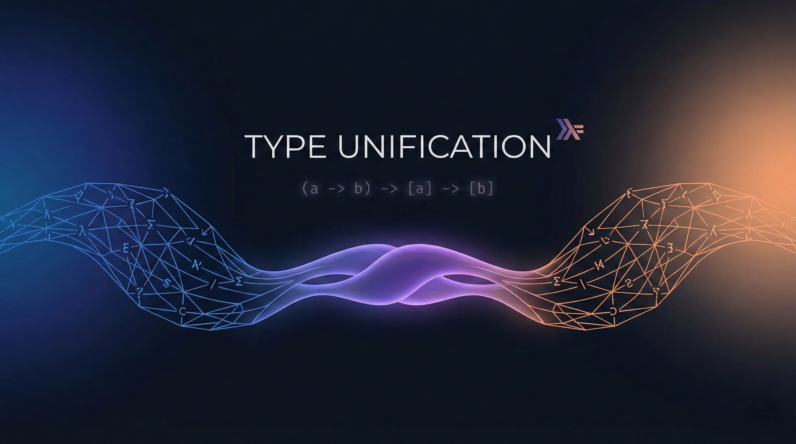

This post exists so that every feature the blog ships is rendered somewhere and
breaks loudly when it regresses. If something below looks wrong, the build is
wrong.

## Asides and directives

Starlight's asides use the `:::` directive syntax:

:::note
This is a note. It comes from `remark-directive`, which is registered in the
Markdown processor.
:::

:::tip[Custom title]
Asides take an optional title in square brackets.
:::

:::caution
Use this one sparingly.
:::

:::danger
And this one even more sparingly.
:::

## GitHub alerts

`starlight-github-alerts` maps GitHub's blockquote alert syntax onto the same
asides, so notes copied straight out of a README render correctly:

> [!NOTE]
> Useful information that users should know.

> [!WARNING]
> Urgent info that needs immediate user attention.

> [!IMPORTANT]
> Key information users need to know to achieve their goal.

## Math

Inline math such as $f : A \to B$ sits in the flow of a sentence, while display
math gets its own block:

$$
\frac{\partial}{\partial t} \psi(x, t)
  = \frac{i\hbar}{2m} \frac{\partial^2}{\partial x^2} \psi(x, t)
$$

A slightly wider one, to exercise horizontal scrolling inside the full-bleed
layout:

$$
\underbrace{\left( \sum_{i=1}^{n} a_i b_i \right)^2}_{\text{inner product}}
  \leq
\underbrace{\left( \sum_{i=1}^{n} a_i^2 \right)}_{\|a\|^2}
\underbrace{\left( \sum_{i=1}^{n} b_i^2 \right)}_{\|b\|^2}
$$

## Code

Code blocks span the full content width and keep their own horizontal scroll:

```haskell title="Unify.hs"
data Type
  = TVar Name
  | TCon Name
  | TApp Type Type
  deriving (Eq, Show)

unify :: Type -> Type -> Either UnificationError Subst
unify (TVar v) t = bind v t
unify t (TVar v) = bind v t
unify (TCon a) (TCon b)
  | a == b = Right mempty
unify (TApp l1 r1) (TApp l2 r2) = do
  s1 <- unify l1 l2
  s2 <- unify (apply s1 r1) (apply s1 r2)
  pure (s2 <> s1)
unify t1 t2 = Left (Mismatch t1 t2)
```

```console
$ pnpm build
[build] 10 page(s) built in 4.20s
```

## Images

Images in Markdown are wrapped by `starlight-image-zoom`, so clicking one opens
it full-screen with its alt text as the caption:



## Keyboard keys

`starlight-kbd` renders key combinations: press <kbd>Ctrl</kbd> + <kbd>K</kbd>
to open search, or <kbd>Esc</kbd> to close it.

## Footnotes

Footnote references get a hover popover[^popover], and still work as ordinary
anchor jumps when JavaScript is unavailable[^progressive].

[^popover]: This is the popover content. It is pulled from the footnote list at
the bottom of the page, so there is exactly one copy of the text.

[^progressive]:
    Progressive enhancement matters here because the popover is bound on
    `astro:page-load`. Without it, the reference is a plain link to the
    footnotes section.

## Tables

| Feature        | Plugin                     | Status |
| -------------- | -------------------------- | ------ |
| Comments       | `starlight-giscus`         | ✅     |
| Blog routes    | `starlight-blog`           | ✅     |
| Image zoom     | `starlight-image-zoom`     | ✅     |
| Back to top    | `starlight-scroll-to-top`  | ✅     |
| Heading badges | `starlight-heading-badges` | ✅     |
| GitHub alerts  | `starlight-github-alerts`  | ✅     |

## A long tail, for the table of contents

The headings below exist only so the table of contents has enough entries to
scroll-spy against.

### Section one

Some filler prose so that each heading occupies enough vertical space for the
scroll-spy highlight to move visibly as you read past it.

### Section two

More of the same. The active entry in the table of contents should track the
heading currently nearest the top of the viewport.

### Section three

And a third, so the highlight has somewhere to land at the bottom of the page.
